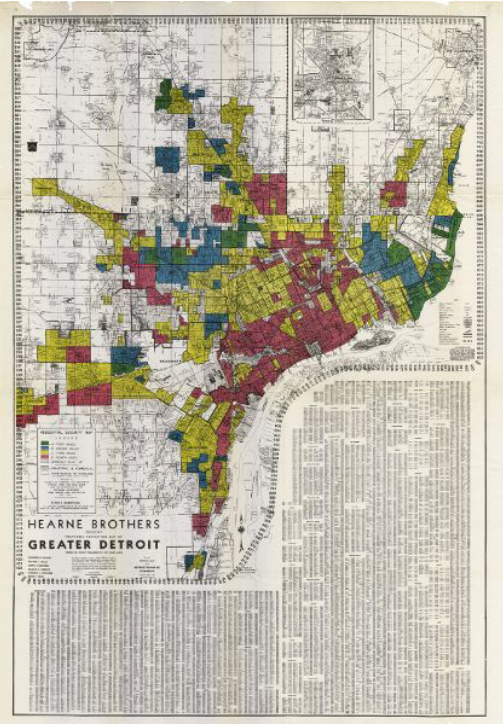

# Report on the Residential Security Map
## By Sabriyah Morshed
*January 12, 2023*

## Data Viz Summary

The Residential Security Map is a redlining map of Detroit. Redlining refers to the practice of banks rating the risk of granting loans to possible homeowners based on their neighborhoods. The Residential Security Map was published in 1939. It is a collaboration between the Detroit Chamber of Commerce and the Federal Home Loan Bank Board, and was designed to help banks determine who they would grant loans to. This map was poorly designed and executed, disproportionately targeting minorities. Risky neighborhoods are indicated by red shading, while blue represents the "safest" neighborhoods. 
> All of Detroit’s Black neighborhoods fall into red areas on this map because housing discrimination and other forms of structural oppression predated the practice. But
denying home loans to the people who lived in these neighborhoods reinforced those
existing inequalities and, as decades of research have shown, were directly responsible
for making them worse.

## Data Viz Biography
**1. Who or what institution produced the visualization?**

The credits for this visualization is cited below:

*Source:* Catherine D'Ignazio, Lauren Klein, *Data Feminism*. 
*Credit:*  Robert K. Nelson, LaDale Winling, Richard Marciano, Nathan Connolly, et al., “Mapping Inequality,” in American Panorama, ed. Robert K. Nelson and Edward L. Ayers

**2. When was it produced?**

Originally, this visualization was produced in 1939.

**3. Who is the audience for the visualization?**

This visualization was intended for banks to use as a way to "safely" decide whether or not a person should receive a loan or not. I use the word very "safely" loosely, because as I will explain in questions 4 and 5, this visualization was not safe at all. In fact, it made already existing stigmas against minorities more concrete at the time.

**4. How might the visualization be interpreted or misinterpreted? What consequences might this interpretation/misinterpretation have?**

There is plenty of room for misinterpretation in analyzing this visualization. In the book Data Feminism, it is mentioned that the all the areas that are shaded red in this map are Black neighborhoods of Detroit. This could easily lead banks to make the decision that Black people should not be granted loans. Historically, this is exactly what happened due to visualizations like these. Instead of using individual credibility to assess eligibility for loans, banks used neighborhood demographics, which specifically targeted Black people.

**5. How, if at all, does the data visualization represent power or systems?**

This data visualization represents power, but more specifically, malice. This map was designed by wealthy people to uphold discrimination and oppression, and to keep minorities prone to poverty from rising financially. Denying loans to specifically targeted minorities largely facilitated the worsening of oppression and injustice.

**NOTE:** All information referenced and cited on this page was taken from the book *Data Feminism*, written by Catherine D'Iglazio and Lauren Klein. A free-access pdf of this book can be downloaded by following the instructions from the link below.

:heart: [Data Feminism](https://direct.mit.edu/books/book/4660/Data-Feminism)